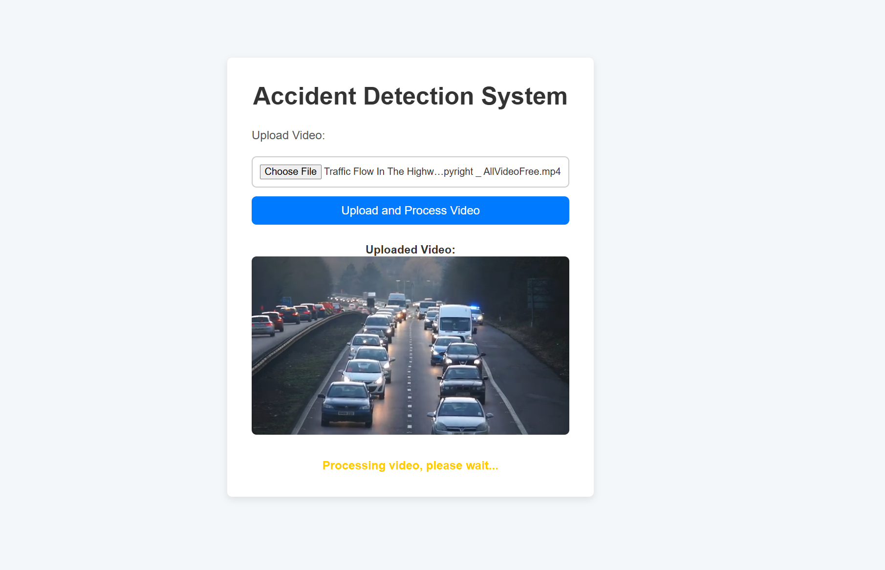

<h1 align="center">🚨 Accident Detection System</h1>
<p align="center">
  <strong>Real-time accident detection and reporting platform using Computer Vision and Deep Learning</strong><br>
  <em>Built with Django, TensorFlow, and OpenCV | Supports traffic monitoring via webcam or video feed</em>
</p>

---



---

## 📌 Overview

The **Accident Detection System** is a machine learning-powered web application that uses video input from surveillance cameras or uploaded footage to detect potential road accidents. It processes the video using a trained deep learning model and provides immediate alerts, which can assist **traffic police**, **emergency responders**, or **smart city systems** in real-time.

---

## 🚀 Features

- 📹 Upload or stream video via webcam
- 🧠 Deep learning-based accident recognition (TensorFlow)
- 🔍 Frame-by-frame video analysis
- 📤 Real-time alerts for traffic authorities
- 📊 Future-ready for integration with smart city platforms

---

## 🛠️ Tech Stack

<p align="left">
  
  
  
  
  
  
</p>

---

## 📸 Screenshot


> Screenshot shows the system in action: video uploaded, displayed, and processed in real-time.

---

## 🧑‍💻 How to Run Locally

```bash
# Clone the repository
git clone https://github.com/yourusername/accident-detection.git
cd accident-detection

# Create and activate virtual environment
python -m venv venv
source venv/bin/activate  # or venv\Scripts\activate on Windows

# Install dependencies
pip install -r requirements.txt

# Run the server
python manage.py runserver
